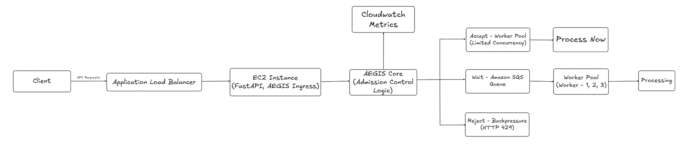

# AEGIS

AEGIS is an AWS-based admission control system designed to protect backend APIs from traffic spikes and overload conditions.

Instead of allowing every incoming request to reach the backend blindly, AEGIS acts as an intelligent gatekeeper that decides whether a request should be processed immediately, queued for later execution, or rejected based on current system capacity and request priority.

---

## Architecture

---

## Key Features

* Intelligent request admission control
* Priority-aware request handling (HIGH / LOW)
* Load shedding using HTTP 429 responses
* Backpressure through controlled queueing
* Distributed request buffering using Amazon SQS
* Asynchronous worker-based processing
* Horizontal scaling through multiple workers
* Real-time monitoring using Amazon CloudWatch

---

## AWS Services Used

| Service                         | Purpose                                     |
| ------------------------------- | ------------------------------------------- |
| Amazon EC2                      | Hosts the FastAPI-based AEGIS service       |
| Application Load Balancer (ALB) | Distributes incoming traffic to the backend |
| Amazon SQS                      | Buffers requests during overload conditions |
| Amazon CloudWatch               | Stores and visualizes custom system metrics |
| AWS IAM                         | Secure access management for AWS resources  |

---

## Components

### FastAPI Ingress Layer

Receives incoming API requests and forwards them to the AEGIS admission controller.

### AEGIS Core

Implements admission control policies and decides whether a request should be:

* ACCEPT
* WAIT
* REJECT

based on current system capacity and queue depth.

### Amazon SQS

Acts as a distributed message queue for buffering requests during overload conditions.

### Worker Service

Consumes queued requests from Amazon SQS and processes them asynchronously.

### CloudWatch Monitoring

Collects custom metrics such as:

* Accepted Requests
* Queued Requests
* Rejected Requests
* Active Workers
* Queue Depth

for real-time observability and monitoring.

---

## Request Lifecycle

1. Client sends a request to the API.

2. Application Load Balancer forwards the request to the EC2-hosted AEGIS service.

3. AEGIS evaluates current system load and queue depth.

4. Request is classified as:

   * **ACCEPT** → Process immediately.
   * **WAIT** → Push to Amazon SQS.
   * **REJECT** → Return HTTP 429 (Too Many Requests).

5. Worker services consume queued requests from Amazon SQS.

6. CloudWatch metrics are updated for monitoring and analysis.

---

## Future Enhancements

* Auto Scaling Groups for dynamic worker scaling
* Priority queues with differentiated service levels
* Rate limiting and quota management
* Dead Letter Queue (DLQ) support
* CloudWatch alarms and automated notifications
* Multi-instance backend deployment